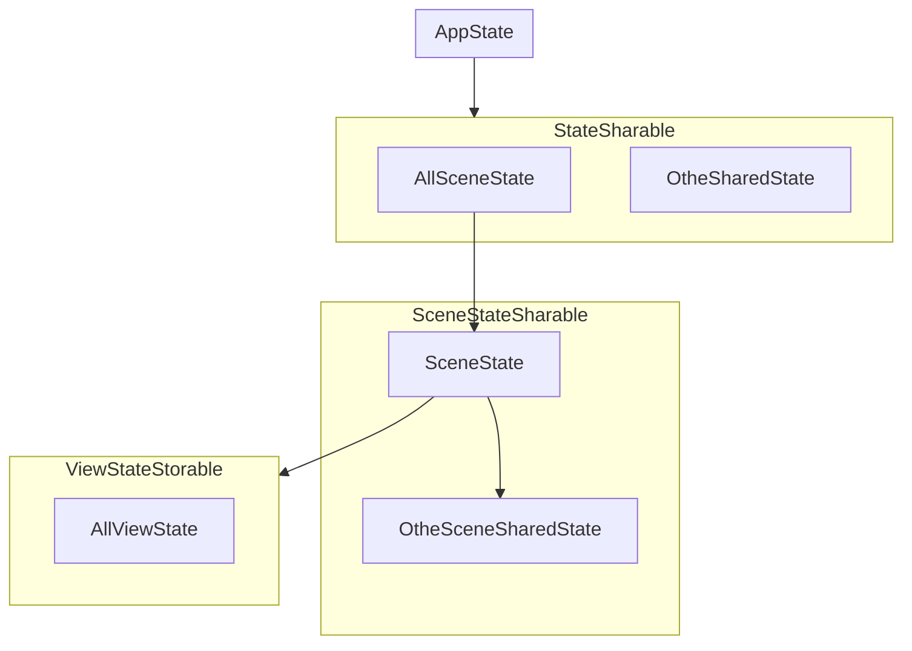

# ViewFlow

ViewFlow 是基于 DataFlow 的 View 层数据绑定模块，为 SwiftUI 提供与 DataFlow 相同的数据存储、数据绑定、事件传递等功能。最终实现界面层的数据流与逻辑层数据流使用相同的交互模式。

ViewFlow 是自定义 RSV(Resource & State & View) 设计模式中 State 层的应用模块，同时也是 View 层的基础模块。负责 State 与 View 的直接绑定和交互。

[](https://github.com/miejoy/view-flow/actions/workflows/test.yml)
[](https://codecov.io/gh/miejoy/view-flow)
[](LICENSE)
[](https://swift.org)

## 依赖

- iOS 13.0+ / macOS 10.15+
- Xcode 12.0+
- Swift 5.4+

## 简介

### 该模块包含如下内容:

- StateStorable 的扩展协议:
  - SceneStateSharable: 当前界面场景的可共享状态
  - FullSceneStateSharable: 完整的界面场景可共享状态
  - ViewStateStorable: 界面使用的可存储状态

- State 的包装器:
  - SceneSharedState: 对当前场景内的可共享状态(SceneStateSharable)的包装器，包装的 Store 和 State 都会存储在当前 SceneState 中
  - ViewState: 界面状态(ViewStateStorable)包装器，包装的 State 回直接存储到当前 SceneState 中
  
- 定义必要的 State:
  - SceneState: 场景状态，用户保存当前场景下的各种数据，包括当前场景的所有 SceneSharedState 和 ViewState 以及所有 SceneSharedState 对应的 Store
  - AllSceneState: 所有场景的状态，暂时非公开。当前状态为 App 共享状态，保存 App 中所有存在的 SceneState，直接依附于 AppState，主要作为 SceneState 和 AppState 关联的桥梁

- View 的扩展协议: 
  - TrackableView: 可追踪的界面协议，

### 各种 State 对应关系如下：




## 安装

### [Swift Package Manager](https://github.com/apple/swift-package-manager)

在项目中的 Package.swift 文件添加如下依赖:

```swift
dependencies: [
    .package(url: "https://github.com/miejoy/view-flow.git", from: "0.1.0"),
]
```

## 使用

### SceneStateSharable 场景共享状态使用

可共享状态可以在所有界面共享使用

1、定义一个可共享状态

```swift
import ViewFlow

struct NormalSharedState : SceneStateSharable {
    typealias UpState = SceneState    
    var name: String = ""
}
```

2、在界面上使用

```swift
import ViewFlow
import SwiftUI

struct NormalSharedView: View {
    
    @SceneSharedState var normalState: NormalSharedState
    
    var body: some View {
        Text(normalState.name)
    }
}
```

### ViewStateStorable 界面状态使用

使用 ViewState 包装的时候，如果对应 State 继承 StateInitable 可不用初始化，没有则必须初始化

```swift
import ViewFlow
import SwiftUI

// 普通 ViewState
struct NormalState : ViewStateStorable {    
    var name: String = ""
}

// 可初始化的 ViewState
struct NormalInitState : ViewStateStorable, StateInitable {    
    var name: String = ""
}

struct NormalSharedView: View {
    
    @ViewState var normalState: NormalState = NormalState()
    @ViewState var initState: NormalInitState
    
    var body: some View {
        VStack {
            Text(normalState.name)
        }
    }
}
```

### SceneState 场景状态使用

场景状态，目前只提供获取当前显示的所有 TrackableView 的列表

```swift
import ViewFlow
import SwiftUI

struct MainSceneView: View {
    
    @SceneSharedState var sceneState: SceneState
    // 使用这种方式获取的 store，在 state 更新是不会有通知，因为 Environment 只会影响他的下一级 View 更新
    // @Environment(\.sceneStore) var sceneStore
    
    var body: some View {
        ZStack(alignment: .top) {
            ContentView()
            Text(sceneState.arrAppearViewPath.first?.description ?? "unknown")
                .zIndex(1)
        }
    }
}
```

### TrackableView 可追踪界面使用

只要继承了 TrackableView 都可以被追踪，在显示的时候会将自己的 ViewPath 传递给当前 SceneState，子界面也可通过 @Environment(\.viewPath) 获取当前父界面的路径

```swift
import ViewFlow
import SwiftUI

struct ContentView: TrackableView {
    // 这里可以获取当前 View 被使用时所在的 ViewPath
    @Environment(\.viewPath) var viewPath
    var content: some View {
        Text("Hello")
    }
}
```

## 作者

Raymond.huang: raymond0huang@gmail.com

## License

ViewFlow is available under the MIT license. See the LICENSE file for more info.
